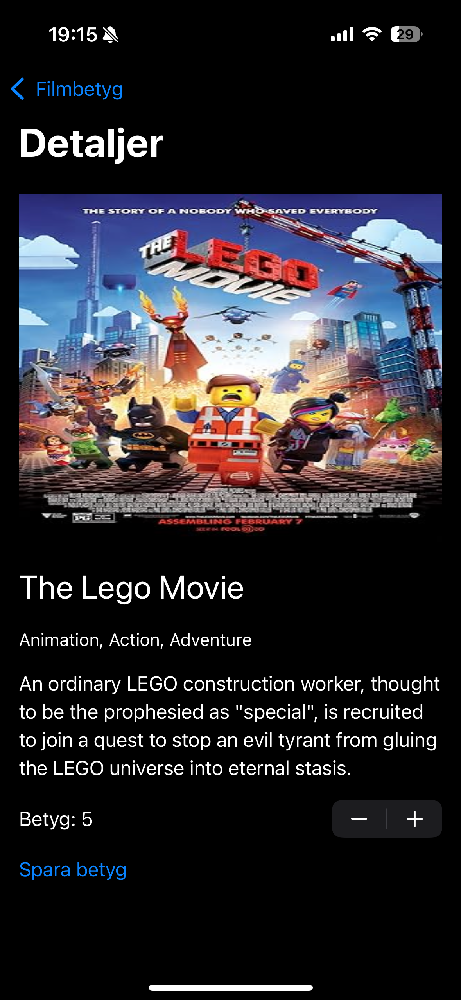

# 🎬 MovieRater – iOS Arbetsprov för Digg

MovieRater är en native iOS-applikation byggd i SwiftUI och Swift 6. Den låter användare söka efter filmer och TV-serier via OMDb API och spara sina egna betyg på dessa titlar. Betyg sparas lokalt i appen med hjälp av en `actor` för säker åtkomst och persistens.

## 🧑‍💻 Funktioner

- 🔍 Sök efter filmer och serier via IMDB (OMDb API)
- ⭐ Sätt betyg från 1 till 10
- 💾 Spara betyg lokalt i appen (ingen backend)
- 📜 Visa lista över tidigare betygsatta titlar
- 🎨 Enkel men modern SwiftUI-design

## 🛠 Teknik

- Swift 6
- SwiftUI
- MVVM (lightweight)
- Concurrency: `actor`, `async/await`
- Local persistence via `UserDefaults`
- Datahämtning från [OMDb API](https://www.omdbapi.com/)

## 🧪 Starta projektet lokalt

1. Skapa en gratis API-nyckel på [https://www.omdbapi.com/apikey.aspx](https://www.omdbapi.com/apikey.aspx)
2. Lägg till din API-nyckel i `MovieService.swift`:

```swift
private let apiKey = "YOUR_API_KEY"
```

3. Öppna projektet i **Xcode 15+**
4. Kör appen på simulator eller fysisk enhet

## 🏗 Arkitektur

- `MainView`: Startsidan med sökfält och lista över betygsatta titlar
- `MovieDetailView`: Visar detaljer för en vald film och låter användaren sätta betyg
- `MovieService`: Hämtar data från OMDb API
- `RatingStore`: En `actor` som hanterar betyg och lokal lagring (använder `UserDefaults`)
- `MovieDetail`: Model för detaljinformation

## 📸 Skärmdumpar

| Huvudvy | Detaljvy |
|--------|----------|
|  |  |


## 📄 Licens

MIT-licens. Endast för kodprov/testsyfte.
